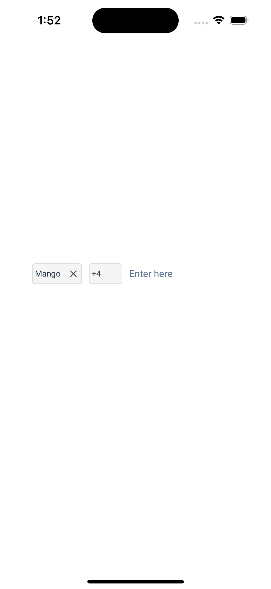
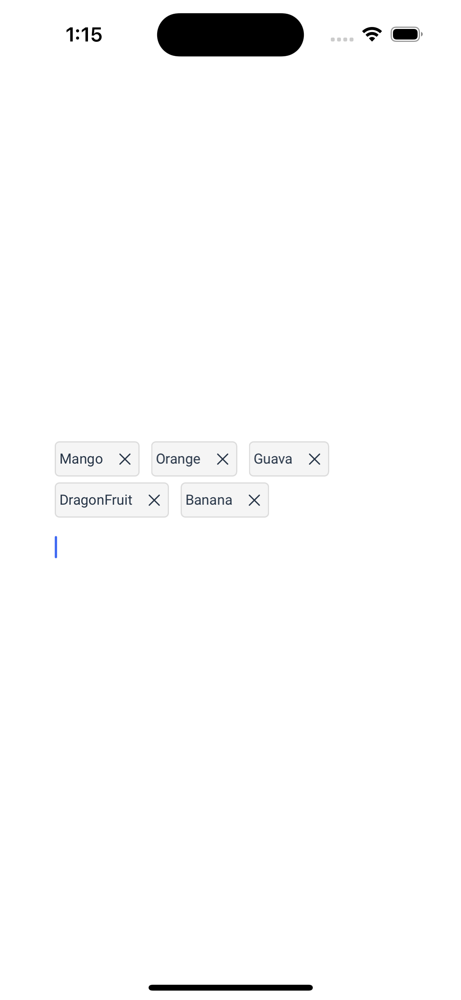

# TagField

- A library to represent a list of tags in a left aligned collectionview.
- Tags get truncated when the textfield gets focused.
- Tags get expanded when the textfield is not focused.

# Xcode Package Dependency:

Use the following link to add TagField as a Package Dependency to an Xcode project:

```
https://github.com/manisrini/TagField
```

# Configuration :

```
let tagComponent = TagFieldComponent()
let tags = [Tag(id: 1, text: "Mango"),Tag(id: 2, text: "Apple")]
let tagVM = TagFieldComponentViewModel(tags: tags,disableTextField: false)
tagComponent.config(viewModel: tagVM)
self.view.addSubview(tagComponent)
 ```

- Can give the initial tags if needed by passing it through a param named "tags".
- Can disable the text field(in case of only displaying the tags) if needed.
- Get callback for the every character entered.

* Append a new tag : (Needed only when you are not using special character configuration) *

```self._tagComponent.appendNewTag(tag: tag)```

# Delegates:

``` func didGetInstance(instance : TagFieldComponent) ```

• Take an example where you are developing a mail editor. For BCC, CC and To fields, we can use the same tagfield component. For instance, you are mentioning a new user, here we can get the instance from this method and append the tag.

``` func handleTypedText (text : String) ```

• Take the same above mentioned example, we can fetch the mentioned users using this text.

``` func didChangeHeight(size : CGSize) ```

• When tags exceeds a line, we can get the height using this method so that we can update parent view height. 

``` func didRemoveTag (removedTag : Tag?, tags : [Tag]) ```

• A callback when each tag is removed.

``` func didGetFrame (origin: (GPoint) ```
• A callback to get the current frame of the textfield.

# TODO LIST :

- Add truncate and expand as a configuration from the user.
- Introduce theme to customise fonts and background colors.

#SCREENSHOTS:

*Truncated state:*



*Expanded state:*



*Demo:* 

https://github.com/manisrini/TagField/assets/55348452/c3101445-9c8a-4bad-84d9-09a69c817a9e


